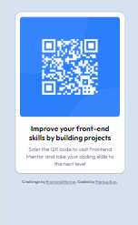
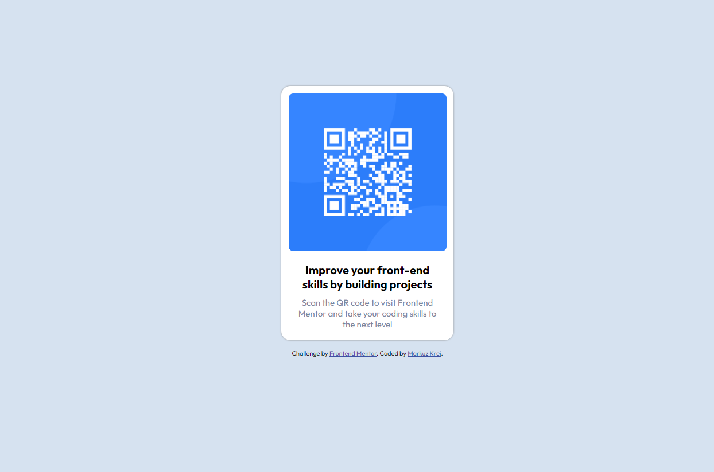

# Frontend Mentor - QR code component solution

This is a solution to the [QR code component challenge on Frontend Mentor](https://www.frontendmentor.io/challenges/qr-code-component-iux_sIO_H). Frontend Mentor challenges help you improve your coding skills by building realistic projects. 

## Table of contents

- [Overview](#overview)
  - [Screenshot](#screenshot)
  - [Links](#links)
- [My process](#my-process)
  - [Built with](#built-with)
  - [What I learned](#what-i-learned)
  - [Continued development](#continued-development)
  - [Useful resources](#useful-resources)
- [Author](#author)
- [Acknowledgments](#acknowledgments)

## Overview
  This is my solution for the QR code component that was assigned to me by Frontend Mentor in the learning path. This is my first solution submission in this platform.

### Screenshot

### Links

- Live Site URL: [QR Code](https://0653jerico.github.io/QRCodebyFrontendMentor/)

## My process

### Built with

- Semantic HTML5 markup
- CSS custom properties

### What I learned

I have learned a lot from this challenge. 
I learned the purpose and how to use the basic media query, 
I also learned how to stop the container from flowing downwards continously, 
I got a glimpse how to import fonts to be used 
and the box-shadow property.

### Continued development

As I go higher, I want to learn how to minimize my code by coding it simply and not having to use so many properties just to perfect the design. I want to get better when using the flexbox property, the grid property, the position property as well as to improve on how I place margins, paddings and widths and heights values perfectly.

### Useful resources

- [W3schools](https://www.W3schools.com) - This website helped me a lot, this is where I search most of the solutions. It provides learning materials as well as explanations which made it easier to understand and learn.
- [Google Fonts](https://www.fonts.google.com) - This is an amazing resource where we can get a lot of beautiful fonts which some does not exist in the built in fonts of the VS Code. We can even set the properties of the fonts before embedding it to our code.
- [Stack Overflow](https://www.stackoverflow.com) - This is also a good platform where you can get help from the IT community. Some of the questions were already asked by someone and answered which makes it easier to understand because they have provided explanations and if there are none then you can also comment and wait for one.

## Author

- Website - [Jerico Jones B. Edic](https://www.your-site.com) - I dont have a website
- Frontend Mentor - [@0653Jerico](https://www.frontendmentor.io/profile/0653Jerico)

## Acknowledgments

I want to thank [W3schools](https://www.W3schools.com) because they provided lots of learning resources which helped me understand new things. I am also grateful for [Frontend Mentor](https://www.frontendmentor.io/) for providing such amazing learning paths and challenges that can really help people learn.

